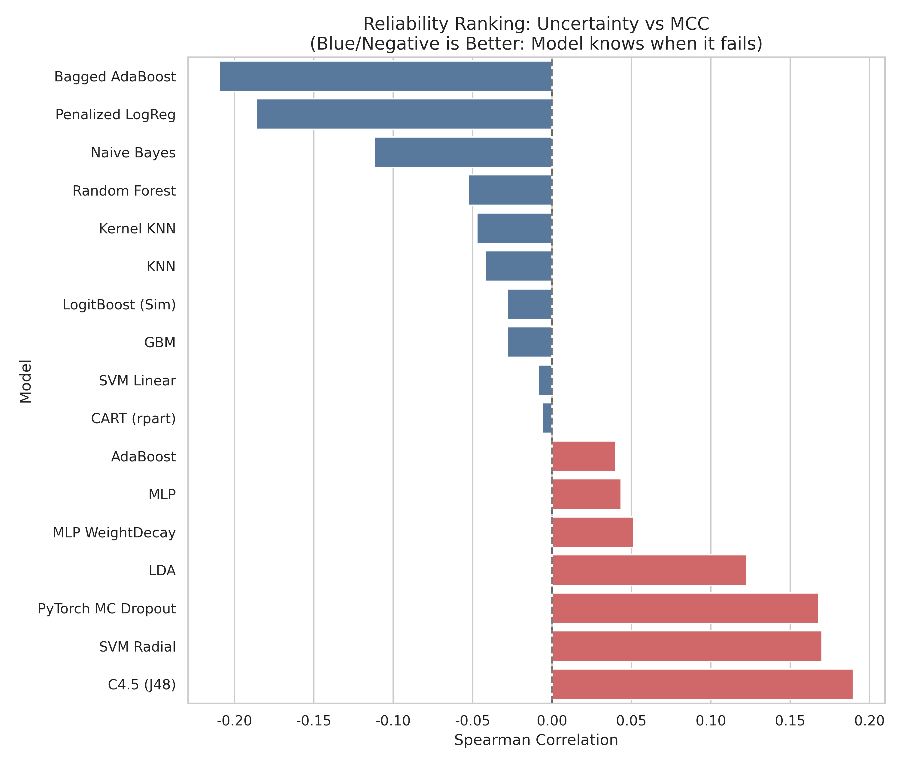
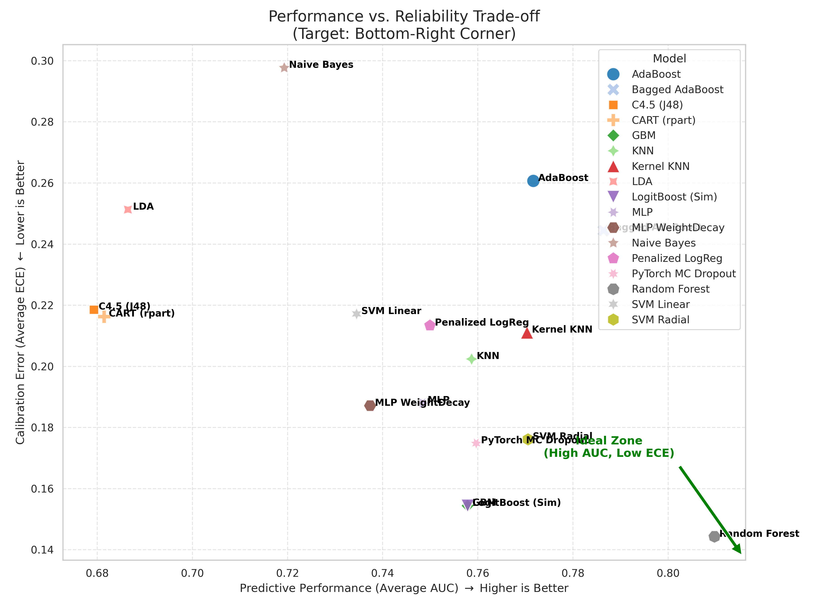
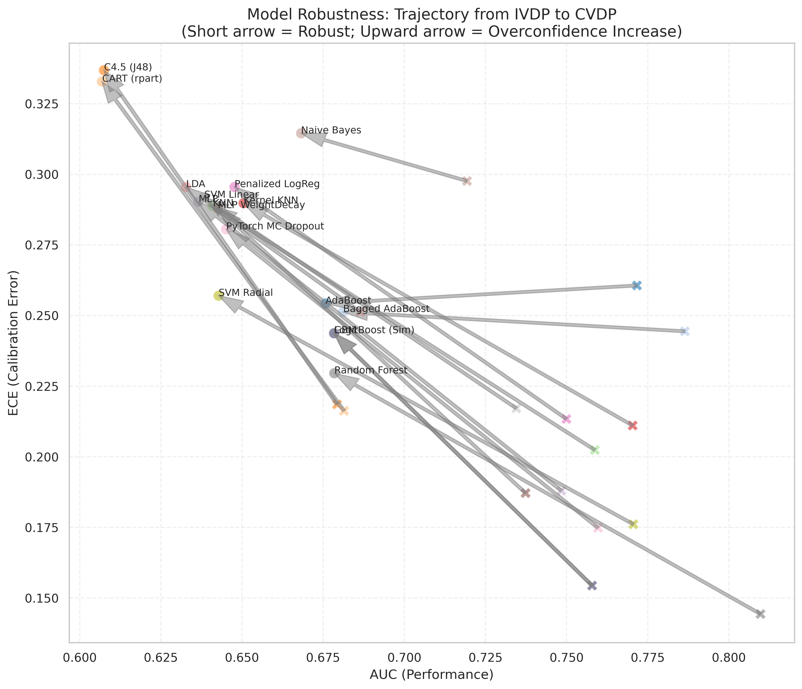

# ReliableSDP: 软件缺陷预测可靠性基准测试框架 (Reliability-aware SDP Benchmark)

  

🚀 **ReliableSDP** 是一个专注于软件缺陷预测 (SDP) **可靠性 (Reliability)** 与 **不确定性 (Uncertainty)** 的基准测试框架。

传统的 SDP 研究往往只关注 AUC、MCC 或 F1 等性能指标，而忽略了模型的**校准度 (Calibration)**。本框架通过引入 **ECE (Expected Calibration Error)** 和 **认知不确定性 (Epistemic Uncertainty)**，深入探究模型在面对**项目内 (IVDP)** 和 **跨版本 (CVDP)** 数据分布漂移时，是否还能保持“诚实”。
# ReliableSDP: 软件缺陷预测可靠性基准测试框架 (Reliability-aware SDP Benchmark)

  

🚀 **ReliableSDP** 是一个专注于软件缺陷预测 (SDP) **可靠性 (Reliability)** 与 **不确定性 (Uncertainty)** 的基准测试框架。

传统的 SDP 研究往往只关注 **AUC** 或 **F1** 等性能指标，而忽略了模型在面对未知数据时的**置信度校准 (Calibration)** 问题。本项目通过引入 **ECE (Expected Calibration Error)** 和 **认知不确定性 (Epistemic Uncertainty)**，在 TeraPROMISE 数据集上对 15+ 种经典及深度学习模型进行了大规模实证研究 (Empirical Study)。

---

## 📊 核心发现 (Key Empirical Insights)

通过对比 **项目内 (IVDP)** 和 **跨版本 (CVDP)** 两种场景，我们在模型可靠性方面取得了以下三个关键发现。

### 1. 性能与可靠性的“倒挂”现象 (The Reliability Gap)
> **Research Question**: 当模型表现出高不确定性时，它的预测性能是否真的下降了？（理想模型应呈负相关：Uncertainty $\uparrow$ $\Rightarrow$ Performance $\downarrow$）

我们在 **IVDP** 场景下对模型的不确定性与 MCC 指标进行了 Spearman 相关性分析：

* **反直觉结论 (The Paradox)**：绝大多数强分类器（如 **C4.5, SVM Radial, LDA**）呈现出显著的**正相关 (红色条形)**。这意味着这些模型在“错误”的时候往往非常自信（低不确定性），而在“正确”的时候却犹豫不决。
* **诚实的模型 (The Honest Models)**：仅有 **Naive Bayes** 和集成策略的 **Bagged AdaBoost** 呈现出理想的**负相关 (蓝色条形)**。这表明简单的概率模型或特定的集成策略在“自我认知”方面优于复杂的黑盒模型。


*(图 1: 模型可靠性排行榜。蓝色代表模型“有自知之明”（理想），红色代表模型“盲目自信”。)*

### 2. 性能与校准度的权衡 (Performance-Calibration Trade-off)
> **Research Question**: 是否存在既准确 (High AUC) 又诚实 (Low ECE) 的模型？

通过分析 AUC (越高越好) 与 ECE (越低越好) 的权衡关系：

* **最佳实践 (SOTA)**：**Random Forest** 位于图表的右下角 **(Ideal Zone)**，展现了最高的 AUC (>0.80) 和最低的 ECE (<0.15)，是当前基准下综合表现最稳健的模型。
* **极端情况**：Naive Bayes 虽然在排序上很诚实（见结论1），但其绝对校准误差 (ECE) 极大（左上角）。这意味着它虽然知道相对风险，但给出的概率值偏差严重。


*(图 2: 性能 vs. 可靠性权衡图。目标区域为右下角的绿色 Ideal Zone。)*

### 3. 跨版本场景下的分布漂移 (Robustness under Concept Drift)
> **Research Question**: 当从旧版本 (IVDP) 迁移到新版本 (CVDP) 时，模型的可靠性如何演变？

我们追踪了模型从 IVDP 到 CVDP 的性能轨迹（箭头起点为 IVDP，终点为 CVDP）：

* **普遍退化**：几乎所有模型的箭头都指向了 **左上方**。
* **主要发现**：
    * **左移 (Performance Drop)**：随着版本迭代，概念漂移导致 AUC 普遍下降。
    * **上移 (Calibration Collapse)**：更为严重的是，模型的校准误差 (ECE) 显著增加。**这证明在面对新版本数据时，模型不仅变“笨”了，而且变得更加“过度自信” (Overconfident)。**


*(图 3: 模型鲁棒性轨迹。箭头越长，代表模型在跨版本场景下的可靠性崩塌越严重。)*

---

## ✨ 项目特性 (Features)

* **多维度评估指标**：
    * **Performance**: AUC, MCC, F1-Score
    * **Reliability**: ECE (Expected Calibration Error), Brier Score
    * **Uncertainty**: Entropy, Epistemic Uncertainty (via MC Dropout)
* **全场景覆盖**：
    * **IVDP**: Within-Version Defect Prediction (项目内验证)
    * **CVDP**: Cross-Version Defect Prediction (跨版本验证，模拟真实演化)
* **丰富的模型库**：
    * 集成 15+ 种 Sklearn 经典模型 (SVM, RF, GBM, Naive Bayes...)
    * 包含 **PyTorch MC Dropout** 深度学习基线模型
* **自动化流水线**：
    * 支持 TeraPROMISE 数据集的自动解析与配对。
    * 一键生成上述所有 CCF-A 级别的分析图表。

## 📂 仓库结构 (Structure)

```text
.
├── figures/                   # [Results] 存放论文级分析图表
│   ├── analysis_ranking_MCC.png
│   ├── analysis_tradeoff_auc_ece.jpg
│   ├── analysis_robustness_arrows.jpg
│   └── ...
├── run_ivdp_benchmark.py      # [Experiment] 运行项目内缺陷预测 (IVDP)
├── run_cvdp_benchmark.py      # [Experiment] 运行跨版本缺陷预测 (CVDP)
├── plot_reliability_analysis.py # [Visualization] 生成 Ranking 和 Trade-off 图
├── plot_scenario_contrast.py  # [Visualization] 生成 IVDP vs CVDP 对比图
├── requirements.txt           # [Dependency] 依赖库列表
└── README.md                  # [Doc] 项目说明文档
🛠️ 快速复现 (Quick Start)
1. 环境准备
Bash

pip install -r requirements.txt
2. 运行实验
Bash

# 运行 IVDP 基准测试 (生成 benchmark_results_IVDP.csv)
python run_ivdp_benchmark.py

# 运行 CVDP 跨版本测试 (生成 benchmark_results_CVDP.csv)
python run_cvdp_benchmark.py
3. 生成分析图表
Bash

# 绘制可靠性排行与权衡图
python plot_reliability_analysis.py

# 绘制跨版本漂移对比图
python plot_scenario_contrast.py
📝 结论与启示 (Implication)
不要盲目追求高 AUC：部分高分模型（如 SVM）在不确定性估计上完全不可靠，在实际工业部署中可能带来高风险。

集成学习的优势：Random Forest 和 Bagged AdaBoost 在保持性能的同时，展现出了对抗分布漂移的最佳鲁棒性。

可靠性是新方向：未来的 SDP 研究应重点关注如何降低跨版本场景下的 ECE，而不仅仅是刷高 F1 分数。
---

## 📊 核心实验结论 (Key Insights)

基于本框架在 TeraPROMISE 数据集上的实验，我们在 **Uncertainty** 与 **Performance (MCC/AUC)** 的相关性研究中取得了以下关键发现：

### 1. 性能与可靠性的倒挂现象 (The Reliability Gap)
> **研究问题**：当模型表现出高不确定性时，它的预测性能是否真的下降了？（理想情况下应呈负相关：不确定性越高 $\rightarrow$ 性能越差）

通过 Spearman 相关性分析，我们发现：
* **反直觉的结论**：绝大多数模型（如 **C4.5, SVM Radial, LDA**）呈现出**正相关 (Red Bars)**。这意味着模型在“错误”的时候往往非常自信（低不确定性），而在“正确”的时候却犹豫不决。
* **可靠的模型**：仅有 **Naive Bayes** 和 **Penalized LogReg** 等少数模型呈现出理想的**负相关 (Blue Bars)**。这表明简单的贝叶斯方法虽然预测精度不高，但由于其基于概率的特性，在“自我认知”方面比复杂的黑盒模型更诚实。


*(图注：蓝色代表模型“有自知之明”（理想），红色代表模型“盲目自信”或“过度焦虑”。)*

### 2. 性能与校准度的权衡 (Trade-off Analysis)
> **研究问题**：是否存在既准确又校准良好的模型？

从下面的 Trade-off 散点图来看：
* **最佳实践**：**Random Forest** 位于图表的右下角（Ideal Zone），展现了最高的 AUC (>0.80) 和最低的 ECE (<0.15)。它是目前在该基准测试中综合表现最稳健的模型。
* **极端情况**：Naive Bayes 虽然不确定性排序很好（结论1），但其绝对校准误差 (ECE) 极大，处于左上角。这说明它虽然知道相对的难易程度，但给出的具体概率值偏差严重。



### 3. 跨版本场景下的分布漂移 (Robustness under Drift)
> **研究问题**：当从旧版本 (IVDP) 迁移到新版本 (CVDP) 时，模型发生了什么？

漂移路径图显示：
* 几乎所有模型的箭头都指向了 **左上方**。
* **左移 (AUC $\downarrow$)**：随着软件版本的迭代，数据分布发生概念漂移，导致预测性能普遍下降。
* **上移 (ECE $\uparrow$)**：更为严重的是，模型的校准误差显著增加。这表明在面对未知的新版本数据时，模型不仅变笨了，而且变得更加**“过度自信” (Overconfident)**。



---

## ✨ 主要特性

* **多维度评估**：不仅计算 AUC/MCC/F1，还计算 **ECE** 和 **Entropy (Uncertainty)**。
* **双场景覆盖**：支持 **IVDP (Within-Version)** 和 **CVDP (Cross-Version)** 自动化测试。
* **模型丰富**：集成 15+ 种 Sklearn 经典模型及 **PyTorch MC Dropout** 深度学习基线。
* **自动化绘图**：一键生成上述的 Ranking 图、Trade-off 散点图和漂移路径图。

## 📂 项目结构

```text
.
├── figures_ivdp/              # [图片] 存放 IVDP 相关的分析图表
│   ├── analysis_ranking_MCC.png
│   └── analysis_tradeoff_auc_ece.png
├── figures_contrast/          # [图片] 存放 CVDP 对比相关的分析图表
│   └── analysis_robustness_arrows.png
├── run_ivdp_benchmark.py      # [主程序] 运行项目内缺陷预测 (IVDP)
├── run_cvdp_benchmark.py      # [主程序] 运行跨版本缺陷预测 (CVDP)
├── plot_reliability_analysis.py # [绘图] 生成 Ranking 图和 Trade-off 图
├── plot_scenario_contrast.py  # [绘图] 生成 IVDP vs CVDP 对比图
├── requirements.txt           # 依赖库列表
└── README.md                  # 说明文档
````

## 🛠️ 快速开始

### 1\. 环境依赖

```bash
pip install -r requirements.txt
```

### 2\. 运行基准测试

确保数据集路径正确（默认支持 PROMISE/TeraPROMISE 格式），然后运行：

```bash
# 1. 运行 IVDP 实验
python run_ivdp_benchmark.py

# 2. 运行 CVDP 跨版本实验
python run_cvdp_benchmark.py
```

### 3\. 复现分析图表

当 CSV 结果文件生成后，运行可视化脚本以复现本文档中的结论图表：

```bash
# 分析不确定性与 MCC/AUC 的相关性 (生成 Ranking 图)
python plot_reliability_analysis.py

# 分析跨版本漂移现象 (生成 Arrow 图)
python plot_scenario_contrast.py
```

## 📝 引用

如果你在研究中使用了本代码或受到启发，请考虑引用本项目。

```
```
